# Roo Code Tips & Tricks

A collection of files designed to supercharge Roo experience and maximize productivity.

## [Roo Code Documentation](personal_roo_docs/)
A comprehensive collection of documentation resources for Roo Code, organized by technical depth and audience:

## Tech References

* 整体流程：
1. https://www.youtube.com/watch?v=LG7Sz-VfFdU
Recursive Engine -> check Point -> load context -> API Ruquest -> Tool Use -> Recursive Engine
2. https://cline.bot/blog/what-makes-a-coding-agent

* checkPoint:
- https://cline.bot/blog/how-i-learned-to-stop-course-correcting-and-start-using-message-checkpoints
- https://github.com/Michaelzag/RooCode-Tips-Tricks/blob/main/personal_roo_docs/technical/checkpoint-system.md

* context window:
1. https://github.com/Michaelzag/RooCode-Tips-Tricks/blob/main/personal_roo_docs/technical/managing-context-window.md

2. https://cline.bot/blog/clines-context-window-explained-maximize-performance-minimize-cost

3. https://talkol.medium.com/performance-limitations-of-react-native-and-how-to-overcome-them-947630d7f440

* 插件
1. https://cline.bot/blog/calling-all-developers-how-to-build-mcp-plugins-with-cline

2. https://aaaaash.notion.site/9a6fbe05da024eaeacc5a46748198223

## Architechure

The [extension-architecture.mmd](./extension-architecture.mmd) file contains a Mermaid diagram showing the high-level architecture of the Cline extension. The diagram illustrates:

1. **Core Extension**
   - Extension entry point and main classes
   - State management through VSCode's global state and secrets storage
   - Core business logic in the Cline class

2. **Webview UI**
   - React-based user interface
   - State management through ExtensionStateContext
   - Component hierarchy

3. **Storage**
   - Task-specific storage for history and state
   - Git-based checkpoint system for file changes

4. **Data Flow**
   - Core extension data flow between components
   - Webview UI data flow
   - Bidirectional communication between core and webview

- **[User-Friendly Guides](personal_roo_docs/normal/)**: Practical guides for everyday Roo Code users covering features, customization, and best practices without technical complexity. Use these to understand what's going on to decide if you need to feed a technical doc into the llm for some purpose.
- **[Technical Documentation](personal_roo_docs/technical/)**: In-depth technical documentation for developers and advanced users who want to understand implementation details. The original goal of these were to create technical documents that could be fed back into Roo for it to understand subsystems. It works pretty well.

## 整体架构图

[architecture.mmd](./architecture.mmd) 为项目整体架构图(mmd)

##  为项目整体架构图(svg)

## [.rooignore  Generator](roo-ignore/README.md)
A simple utility script that generates and updates `.rooignore` files to prevent LLM context overflow. The script:

- Focuses primarily on identifying large files exceeding token limits
- Preserves existing .rooignore content and custom patterns
- Skips scanning large directories for efficiency
- Requires no external dependencies (pure Node.js)

## [.roomodes Validator](roomodes-validator/README.md)
A validation tool that checks `.roomodes` files against Roo-Code specifications and fixes common issues.

- Identifies structural problems, invalid slugs, missing fields, and improper regex patterns
- Provides automatic fixing with the `--fix` flag to correct detected issues
- Validates all aspects of custom modes including tool groups and file restrictions
- Outputs clear, actionable error messages to guide manual corrections

## 整体架构图

[architecture.mmd](./architecture.mmd) 为项目整体架构图(mmd)

##  

## Cheatsheets

Resources in the [cheatsheets](cheatsheets/) directory:
- **[Large File Handling](cheatsheets/llm-large-file-cheatsheet.md)**: Handle files that exceed context windows

**Happy Coding with Roo!** 🐨
